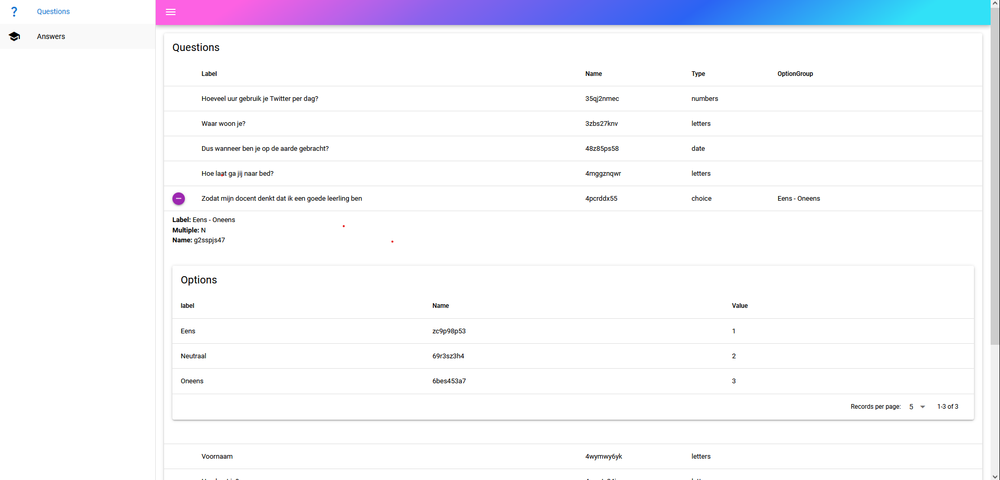
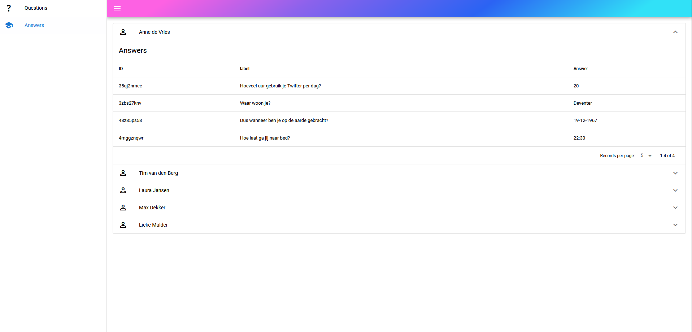

# Scorion in-house day

A workshop project for Scorion in-house day

## Install the dependencies
```bash
yarn
# or
npm install
```

### Start the app in development mode (hot-code reloading, error reporting, etc.)
```bash
quasar dev
```

### Install Node (only if not installed yet)
`` https://nodejs.org/en/download``


___
## Assignment 1 - Questions (Questions.vue)
For this assignment you will need to use `vars.json`, `optiongroups.json` and `optiongroupoptions.json`.

Shown below is a small example of how it should look.


## Assignment 2 - Answers (Answers.vue)
For this assignment you will need to use `answers.json`, and `optiongroupoptions.json`.

Extract all the unique users from the `answers.json` and find the answers to the questions.

Shown below is a small example of how it should look.


## Assignment 3 (BONUS)
Fix the search bar on the Answers page and be able to switch between value and label of optionGroupOptions

---

## Helpfull information:

### Vue.js documentation
https://vuejs.org/api/

### Quasar framework documentation
https://quasar.dev/components

### Array prototype Documentation ( things like - filter, map, reduce, every)
https://developer.mozilla.org/en-US/docs/Web/JavaScript/Reference/Global_Objects/Array
